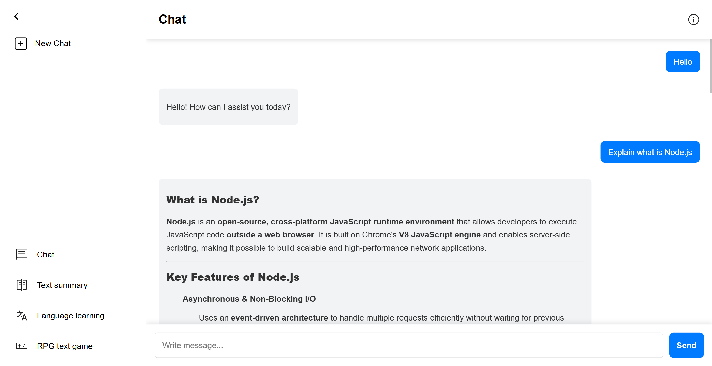
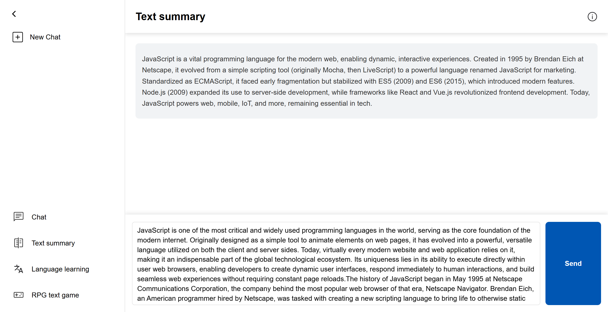
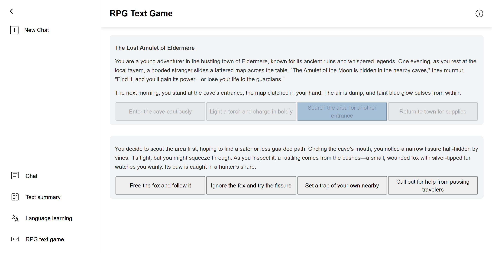

# LLM-API-Application
A Node.js Express application with AI tools. It connects to [Mistral AI](https://mistral.ai/) via API to provide access to LLM.

## Authors
- Szymon Fujawa [@JustSG](https://github.com/JustSG)
- Karol Kopczyński [@KarixD2137](https://github.com/KarixD2137)

## Features

**Chat** - Chat freely with your AI assistant. Ask questions, get help with code, writing, or everyday tasks.

**Text summary** - Summarize the most important information from large pieces of text.

**RPG Text Game** - Play a RPG style text game. AI tells you the story and situation you are in. Each time you need to make decision by choosing one of four actions.

## Future ideas
**Language Learning** - Learn language of your choice by role-playing random simulated situations.